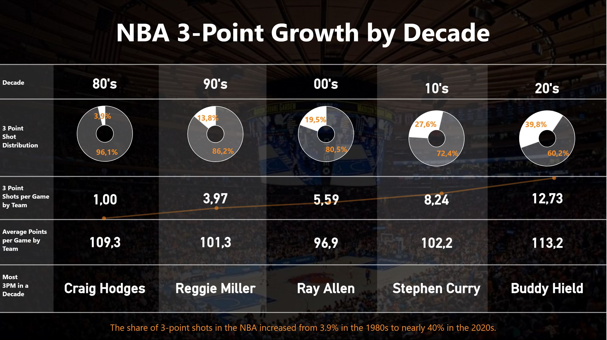
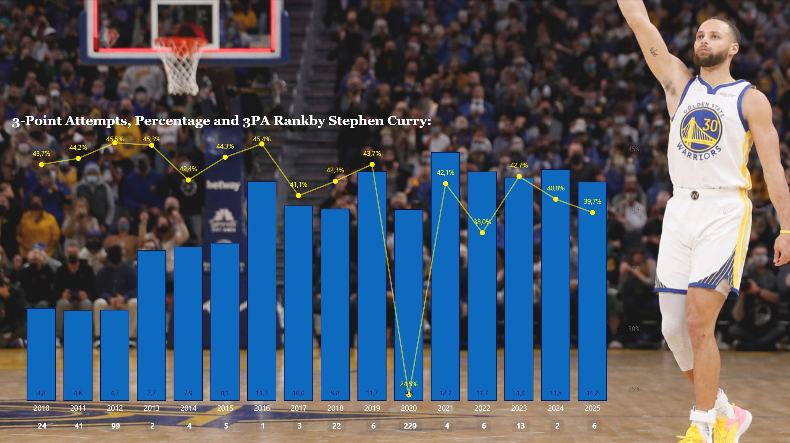

# 🏀 3PT Evolution in the NBA

## Overview
This module analyzes how the importance of the 3-point shot in the NBA has evolved over time.

Using historical data (from 1947 to present), the analysis highlights how shot selection and scoring patterns changed across decades, reflecting one of the biggest strategic shifts in modern basketball.

---

## Key Insights
- 3-point shots made per game increased **over 10x** since the 1980s  
- Shot distribution shifted heavily toward 3-point attempts  
- The NBA moved from defense-oriented basketball (90s / early 2000s) to a fast-paced, offensive game  
- Modern playstyle is strongly influenced by players like Stephen Curry  

---

## Dashboard
📊 [Download Power BI file](./nba_3pt_evolution.pbix)

---

## Visuals

### Growth by decade

### Stephen Curry impact

---

## Tools
- Power BI  
- DAX  
- Data modeling  

---

## Data
The analysis is based on a large historical NBA dataset stored in CSV format (starting from 1947).

---

## Author
Karol Walaszczyk
